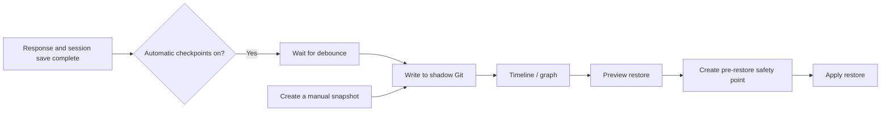

# State Checkpoints

**State checkpoints** maintain a local, restorable history for the current Agent workspace. You can restore an earlier conversation state and optionally restore long-term memory or selected workspace files with it.

> Console: **Agent → Checkpoints**
> Chat: send `/checkpoint`

Checkpoints are designed for frequent saves and quick rollbacks. They are not full-instance backups and never rewrite your project's own Git history. To migrate an instance or preserve global settings and secrets, use [Backup & Restore](./backup).

---

## When to use checkpoints

| Scenario                                             | Recommended action                           |
| ---------------------------------------------------- | -------------------------------------------- |
| Before a risky conversation or tool operation        | Create a named snapshot                      |
| Return to an earlier conversation state              | Restore the conversation only                |
| Roll back `MEMORY.md` and `memory/` as well          | Restore with memory included                 |
| The Agent accidentally changed a few workspace files | Preview the diff and select only those files |
| Automatic checkpoints consume too much disk space    | Preview and run garbage collection           |

> 💡 Create a **named snapshot** at important milestones. Named snapshots are not removed by automatic garbage collection and make better long-term anchors than timeline numbers.

---

## How it works

Every workspace has an independent shadow Git repository:

```text
<workspace>/checkpoints/
├─ shadow.git/   # Checkpoint objects and refs
├─ heads.json    # Current checkpoint for each session
└─ config.toml   # Automatic-save, retention, and safety settings
```

The shadow repository is completely separate from a project `.git/`. It never creates project branches or commits and never modifies the project's index. Git automatically deduplicates identical objects, so consecutive checkpoints normally add only changed data.



Logical parent metadata records the relationship between checkpoints, allowing the Console to display branching history. If you restore an older checkpoint and continue working, a new branch grows from that point without deleting later checkpoints.

---

## Checkpoint types

| Type                                       | Created by                                                                                         | Retention                          |
| ------------------------------------------ | -------------------------------------------------------------------------------------------------- | ---------------------------------- |
| **Automatic checkpoint** (auto)            | Created in the background after a successful non-command response when automatic saves are enabled | Cleaned according to count and age |
| **Named snapshot** (snapshot)              | Click **Create snapshot** in the Console or run `/checkpoint snapshot`                             | Never removed by automatic GC      |
| **Pre-restore safety point** (pre-restore) | Created automatically before every applied restore                                                 | Kept for 7 days by default         |

**HEAD** in the timeline marks the checkpoint currently selected for a session. It is a state marker, not a fourth checkpoint type, and garbage collection never deletes a session HEAD.

---

## Enable automatic checkpoints

Automatic checkpoints are disabled by default. Turn on **Automatic checkpoints** on the Console's Checkpoints page, or use:

```text
/checkpoint auto           # Show current status
/checkpoint auto on        # Enable
/checkpoint auto off       # Disable
```

Once enabled, QwenPaw creates an automatic checkpoint when all of the following are true:

1. The Agent response completed successfully.
2. The current session was saved successfully.
3. The user input was not a command beginning with `/`.
4. The debounce interval since this session's last automatic checkpoint has elapsed; the default is 1.5 seconds.

Creation runs in the background. If several responses finish close together, debouncing coalesces them to avoid redundant checkpoints.

---

## Create a named snapshot

In the Console, click **Create snapshot** and enter a name. You can also run:

```text
/checkpoint snapshot before-refactor
/checkpoint snapshot "before release"
```

If you omit the name, QwenPaw generates one. Names are normalized into safe ref names; when a session already has the same name, QwenPaw appends a numeric suffix.

---

## View the timeline

The Console provides graph and list views with type, session, and text filters. In chat, use:

```text
/checkpoint timeline
/checkpoint timeline --limit=50
/checkpoint timeline --all
```

- The default view shows the current session's latest 20 records.
- `--limit=N` changes the result count; the default maximum is 200.
- `--all` displays checkpoints from every session in the workspace; without it, only the current session is shown.

A restore target can be:

| Form            | Example           | Meaning                                                                                    |
| --------------- | ----------------- | ------------------------------------------------------------------------------------------ |
| Timeline number | `#3` or `3`       | The third row in the current-session output; the number can change as the timeline changes |
| Snapshot name   | `before-refactor` | A named snapshot in the current session                                                    |
| Commit SHA      | `1a2b3c4`         | A SHA prefix of at least 7 characters                                                      |

> 💡 If you need to reuse a target later, copy its SHA or create a named snapshot instead of relying on a timeline number.

---

## Restore a checkpoint

### Restore scopes

Every restore includes the **current conversation**. Other scopes must be enabled explicitly:

| Scope                | Default  | Restored content                                              |
| -------------------- | -------- | ------------------------------------------------------------- |
| Current conversation | Included | The current session file and Agent conversation state         |
| Long-term memory     | Excluded | `MEMORY.md` and `memory/`                                     |
| Workspace files      | Excluded | Ordinary workspace files explicitly selected from the preview |

Memory restore does not roll back derived ReMe indexes, caches, digests, resource directories, or `history.db`. Those runtime data remain current and can be regenerated by the system when needed.

### Restore from the Console

1. Open **Agent → Checkpoints**.
2. Select a checkpoint in the graph or list and click **Restore**.
3. Choose whether to include long-term memory and workspace files.
4. Click **Preview** and inspect everything that would be overwritten, created, or deleted.
5. If workspace files are included, select only the paths you intend to restore.
6. Confirm the restore. The Console applies the exact commit returned by the preview, so a timeline update cannot silently change the target.
7. Refresh the conversation page to load the restored session state.

### Restore from chat

Restore the conversation only:

```text
/checkpoint restore #3 --dry-run
/checkpoint restore #3 --confirm
```

Restore long-term memory as well:

```text
/checkpoint restore before-refactor --include-memory --dry-run
/checkpoint restore before-refactor --include-memory --confirm
```

Workspace-file restore is always a two-step operation. Preview the candidate changes first:

```text
/checkpoint restore 1a2b3c4 --include-files --dry-run
```

Then explicitly list the paths to apply:

```text
/checkpoint restore 1a2b3c4 --include-files --files README.md "notes/plan v2.md" --confirm
```

You can combine memory and file restore:

```text
/checkpoint restore 1a2b3c4 --include-memory --include-files --files README.md src/example.py --confirm
```

`--files` can be repeated and accepts comma-separated values. Quote paths containing spaces. Every path must be workspace-relative; absolute paths and `..` are rejected.

> ⚠️ If a selected file does not exist in the target checkpoint, restoring it **deletes the current file**. The preview labels these operations as deletions—review each one before confirming.

### What if I only enter a target?

This command does not modify anything:

```text
/checkpoint restore #3
```

QwenPaw returns the corresponding preview and confirmation commands. `--dry-run` and `--confirm` are mutually exclusive, and an applied restore always requires explicit `--confirm`.

---

## Restore safety

Checkpoint restore uses several layers of protection:

1. **Preview first**: `--dry-run` computes changes without writing to the workspace.
2. **Pin the target**: the Console applies the exact commit SHA returned by the preview.
3. **Pause internal writers**: an applied restore pauses cooperating internal schedulers and waits for tracked Agent tasks.
4. **Create a safety point**: QwenPaw creates a pre-restore checkpoint before changing anything.
5. **Roll back on failure**: if applying the restore fails, QwenPaw attempts to restore changed paths and the session HEAD.

If internal tasks do not finish before the safety timeout, the restore is cancelled instead of forcing an overwrite. Wait for the tasks to finish, then preview and restore again.

> ⚠️ Internal coordination cannot pause external editors, scripts, or other processes. Avoid external writes to the same workspace during restore. If files change after a preview, cancel and preview again.

A restore can only use checkpoints accessible to the current session. Other sessions may be visible in the Console, but cannot be used to overwrite the wrong session identity.

---

## Clean up old checkpoints

The default retention policy is:

| Object                    | Default policy                                                                           |
| ------------------------- | ---------------------------------------------------------------------------------------- |
| Automatic checkpoints     | Keep the newest 20 per session, or records younger than 7 days                           |
| Pre-restore safety points | Keep for 7 days                                                                          |
| Named snapshots           | Excluded from GC; removed when their session is deleted or the checkpoint store is reset |
| Session HEAD              | Always keep                                                                              |

The automatic-checkpoint count and age rules use OR semantics: a checkpoint is kept if it is among the newest 20 or is less than 7 days old.

The Console lets you preview normal cleanup or **thorough compaction** before confirming. Chat commands:

```text
/checkpoint gc --dry-run
/checkpoint gc --confirm
/checkpoint gc --all-sessions --dry-run
/checkpoint gc --all-sessions --confirm
/checkpoint gc --compact --dry-run
/checkpoint gc --compact --confirm
```

- GC handles the current session by default; `--all-sessions` handles every session in the workspace.
- `--compact` removes every non-HEAD automatic checkpoint. Named snapshots remain, and pre-restore points still follow their age policy.
- Without `--dry-run` or `--confirm`, the command only displays confirmation instructions.

---

## Stored content and boundaries

Checkpoints store conversation state, memory source files, and ordinary workspace content needed for restore, while excluding runtime state that should not be rolled back.

| Category                              | Behavior                                                                                              |
| ------------------------------------- | ----------------------------------------------------------------------------------------------------- |
| `sessions/`                           | Stored and handled by conversation restore                                                            |
| `MEMORY.md`, `memory/`                | Stored and restored only when memory is included                                                      |
| Ordinary workspace files              | Stored and restored only after explicit selection                                                     |
| Project `.git/`                       | Excluded; project history is never modified                                                           |
| `checkpoints/`                        | Excluded so the shadow repository never snapshots itself                                              |
| Credentials and runtime configuration | Excluded, including `credentials.yaml`, `agent.json`, and `access_control.json`                       |
| QwenPaw runtime state                 | Excluded, including `history.db`, cron state, caches, derived memory indexes, media, and tool results |
| Persona and runtime skill files       | Excluded, including `AGENTS.md`, `SOUL.md`, and `skills/`                                             |
| Development artifacts                 | Excluded, including `.venv/`, `node_modules/`, `dist/`, `build/`, logs, and Python caches             |

Checkpoints use their own exclusion rules; a workspace `.gitignore` does not narrow the checkpoint boundary. Binary files and line endings are stored byte-for-byte, and the shadow repository disables Git filters that could rewrite content.

> ⚠️ Ordinary workspace files can still contain sensitive information you created. Checkpoints stay inside the local workspace, so protect `<workspace>/checkpoints/` as you would the workspace itself.

---

## Configuration

The configuration file is created at `<workspace>/checkpoints/config.toml`:

```toml
[gc]
gc_keep_count = 20
gc_keep_days = 7
pre_restore_retention_days = 7

[auto]
enabled = false
debounce_seconds = 1.5

[timeline]
default_limit = 20
max_limit = 200

[display]
query_preview_chars = 120

[safety]
include_memory_quiesce_timeout = 30.0
```

| Setting                          | Meaning                                                     |
| -------------------------------- | ----------------------------------------------------------- |
| `gc_keep_count`                  | Number of newest automatic checkpoints retained per session |
| `gc_keep_days`                   | Age-based retention for automatic checkpoints               |
| `pre_restore_retention_days`     | Retention for pre-restore safety points                     |
| `enabled`                        | Whether automatic checkpoints are enabled                   |
| `debounce_seconds`               | Per-session debounce interval for automatic checkpoints     |
| `default_limit` / `max_limit`    | Default and maximum timeline result counts                  |
| `query_preview_chars`            | Maximum user-query preview length in the timeline           |
| `include_memory_quiesce_timeout` | Maximum seconds to wait for internal tasks before restore   |

The Console can edit the three GC retention settings directly. Edit the TOML file for the other advanced settings. Invalid or out-of-range values fall back to safe defaults.

---

## Reset checkpoints

Reset deletes all checkpoint history for the current workspace and reinitializes the shadow repository:

```text
/checkpoint reset --confirm
```

Automatic checkpoints return to the disabled state after reset. Reset does not delete the current conversation, long-term memory, or ordinary workspace files, but removed checkpoint history can no longer be recovered through QwenPaw.

---

## Checkpoints vs. backups vs. project Git

| Capability                   | State checkpoints       | Backup & Restore                                    | Project Git            |
| ---------------------------- | ----------------------- | --------------------------------------------------- | ---------------------- |
| Primary purpose              | Frequent state rollback | Migration and disaster recovery                     | Source version control |
| Scope                        | One Agent workspace     | Agents, global config, skill pool, optional secrets | Project-tracked files  |
| Conversation state           | Yes                     | Yes                                                 | Usually no             |
| Selective file restore       | Yes                     | By backup module                                    | Yes                    |
| Rewrites project Git history | No                      | No                                                  | Yes                    |
| Portable archive             | No                      | Yes                                                 | Depends on a remote    |

The three tools complement each other: use checkpoints for everyday rollback, project Git for code, and backups before upgrades or for cross-device migration.

---

## FAQ

### Why does QwenPaw say Git is missing?

Checkpoints require Git on the local machine. Install it from [git-scm.com](https://git-scm.com/downloads), verify that `git` works in a terminal, and restart QwenPaw.

### Why does the conversation page still show the old state after restore?

The page may still hold the pre-restore session in memory. Refresh the conversation page or reopen the session to load the restored state.

### Why is a file missing from the restore candidates?

Unchanged files are not listed. Conversation, memory, and QwenPaw runtime files are also excluded from ordinary file candidates because dedicated restore flows handle them or they are intentionally not restorable.

### Can I return to the state from before a restore?

Yes. Every applied restore creates a pre-restore safety point first. It is kept for 7 days by default and can be found and previewed in the timeline.

### Will the checkpoint store grow forever?

Git deduplicates identical content, and automatic GC removes old refs according to the retention policy. You should still review storage statistics periodically and run cleanup after inspecting its preview.

---

## Related documentation

- [Magic commands](./commands)
- [Long-term memory](./memory)
- [Backup & Restore](./backup)
- [Config & working directory](./config)
