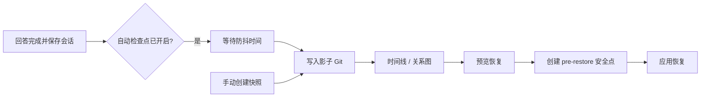

# 状态检查点

**状态检查点**为当前 Agent 工作区保存一条可回退的本地历史。你可以恢复某次对话状态，并按需同时恢复长期记忆或指定的工作区文件。

> 控制台入口：**Agent → 检查点**
> 对话入口：发送 `/checkpoint`

检查点适合频繁保存和快速回退，但它不是整机备份，也不会改写项目自身的 Git 历史。需要迁移实例、保存全局配置或密钥时，请使用[备份与恢复](./backup)。

---

## 适合什么场景

| 场景                                       | 推荐操作                         |
| ------------------------------------------ | -------------------------------- |
| 尝试一段高风险对话或工具操作前             | 创建命名快照                     |
| 想回到较早的对话状态                       | 只恢复会话                       |
| 希望连同 `MEMORY.md` 和 `memory/` 一起回退 | 恢复会话并包含记忆               |
| Agent 意外改坏了工作区中的少量文件         | 预览差异后，只选择需要恢复的文件 |
| 自动检查点较多、占用磁盘空间               | 预览并执行垃圾回收               |

> 💡 建议在关键节点创建**命名快照**。命名快照不会被自动垃圾回收删除，比时间线编号更适合作为长期锚点。

---

## 工作原理

每个工作区都有一套独立的影子 Git 仓库，位于：

```text
<workspace>/checkpoints/
├─ shadow.git/   # 检查点对象和引用
├─ heads.json    # 各会话当前所处的检查点
└─ config.toml   # 自动保存、保留策略和安全参数
```

影子仓库与工作区中的项目 `.git/` 完全分离，不会创建项目分支、提交或修改项目索引。相同内容由 Git 对象自动去重，因此连续检查点通常只新增发生变化的数据。



检查点之间的关系由逻辑父节点记录，因此控制台可以显示分支式历史。恢复到旧节点后继续工作，会从该节点形成新的历史分支，而不是删除后面的检查点。

---

## 检查点类型

| 类型                            | 产生方式                                              | 保留规则             |
| ------------------------------- | ----------------------------------------------------- | -------------------- |
| **自动检查点**（auto）          | 开启自动保存后，在非命令回答成功保存时后台创建        | 按数量和天数自动清理 |
| **命名快照**（snapshot）        | 在控制台点击“创建快照”，或执行 `/checkpoint snapshot` | 不参与自动清理       |
| **恢复前安全点**（pre-restore） | 每次真正执行恢复前自动创建                            | 默认保留 7 天        |

时间线中的 **HEAD** 表示当前会话目前指向的检查点。它是一种状态标记，不是第四种检查点；垃圾回收不会删除会话 HEAD。

---

## 开启自动检查点

自动检查点默认关闭。你可以在控制台的“检查点”页面打开**自动检查点**，也可以在对话中使用：

```text
/checkpoint auto           # 查看当前状态
/checkpoint auto on        # 开启
/checkpoint auto off       # 关闭
```

开启后，QwenPaw 会在以下条件都满足时创建自动检查点：

1. Agent 的回答已成功完成；
2. 当前会话已成功保存；
3. 用户输入不是以 `/` 开头的命令；
4. 距离本会话上次自动检查点已超过防抖时间，默认 1.5 秒。

创建工作在后台执行。短时间内连续完成多个回答时，防抖机制会将它们合并，减少重复检查点。

---

## 创建命名快照

在控制台点击右上角的**创建快照**，填写名称后即可保存。也可以在对话中执行：

```text
/checkpoint snapshot before-refactor
/checkpoint snapshot "发布前状态"
```

如果省略名称，QwenPaw 会自动生成一个名称。快照名称会被规范化为安全的引用名；同一会话中出现重名时，系统会自动追加数字后缀。

---

## 查看时间线

控制台支持关系图和列表视图，并可按类型、会话或关键词筛选。对话中可使用：

```text
/checkpoint timeline
/checkpoint timeline --limit=50
/checkpoint timeline --all
```

- 默认显示当前会话最近 20 条记录。
- `--limit=N` 调整返回数量，最大值默认是 200。
- `--all` 显示此工作区中所有会话的检查点；不加时只显示当前会话。

恢复目标可以写成：

| 写法       | 示例              | 说明                                              |
| ---------- | ----------------- | ------------------------------------------------- |
| 时间线编号 | `#3` 或 `3`       | 当前会话输出中的第 3 条；时间线变化后编号可能改变 |
| 快照名称   | `before-refactor` | 当前会话中的命名快照                              |
| 提交 SHA   | `1a2b3c4`         | 至少 7 位的 SHA 前缀                              |

> 💡 需要稍后再次使用同一个目标时，优先复制 SHA 或使用命名快照，不要长期依赖时间线编号。

---

## 恢复检查点

### 恢复范围

每次恢复都包含**当前会话**，其他范围必须显式开启：

| 范围       | 默认   | 恢复内容                                 |
| ---------- | ------ | ---------------------------------------- |
| 当前会话   | 包含   | 当前会话的 session 文件和 Agent 对话状态 |
| 长期记忆   | 不包含 | `MEMORY.md` 和 `memory/`                 |
| 工作区文件 | 不包含 | 预览中明确选中的普通工作区文件           |

长期记忆恢复不包括 ReMe 的派生索引、缓存、digest、资源目录或 `history.db`。这些运行时数据保持当前状态，并可在需要时由系统重新生成。

### 在控制台恢复

1. 打开 **Agent → 检查点**。
2. 在关系图或列表中选择目标检查点，点击**恢复**。
3. 选择是否包含长期记忆和工作区文件。
4. 点击**预览**，确认将被覆盖、创建或删除的内容。
5. 如果包含工作区文件，只勾选确实需要恢复的路径。
6. 确认恢复。执行时使用的是预览返回的精确提交，不会因为时间线更新而换成另一个目标。
7. 恢复会话后刷新对话页面，以加载恢复后的状态。

### 在对话中恢复

只恢复会话：

```text
/checkpoint restore #3 --dry-run
/checkpoint restore #3 --confirm
```

同时恢复长期记忆：

```text
/checkpoint restore before-refactor --include-memory --dry-run
/checkpoint restore before-refactor --include-memory --confirm
```

恢复工作区文件必须分两步。先查看候选差异：

```text
/checkpoint restore 1a2b3c4 --include-files --dry-run
```

再明确列出要应用的路径：

```text
/checkpoint restore 1a2b3c4 --include-files --files README.md "notes/plan v2.md" --confirm
```

也可以同时包含长期记忆：

```text
/checkpoint restore 1a2b3c4 --include-memory --include-files --files README.md src/example.py --confirm
```

`--files` 支持重复使用和逗号分隔。包含空格的路径必须加引号。路径必须是工作区内的相对路径，不能使用绝对路径或 `..`。

> ⚠️ 如果选中的文件在目标检查点中不存在，恢复会**删除当前文件**。预览会把这类操作标记为删除，请在确认前逐项检查。

### 只输入恢复目标会发生什么

下面的命令不会直接修改任何内容：

```text
/checkpoint restore #3
```

QwenPaw 会返回预览和确认命令。`--dry-run` 与 `--confirm` 互斥；真正恢复必须显式使用 `--confirm`。

---

## 恢复安全机制

检查点恢复包含多层保护：

1. **先预览**：`--dry-run` 只计算变化，不写入工作区。
2. **固定目标**：控制台执行恢复时使用预览得到的精确提交 SHA。
3. **暂停内部写入**：执行恢复时暂停可协作的内部调度，并等待已跟踪的 Agent 任务结束。
4. **创建安全点**：修改任何内容前自动保存 pre-restore 检查点。
5. **失败回滚**：应用过程中出错时，QwenPaw 会尝试恢复已修改的路径和会话 HEAD。

如果内部任务在安全超时时间内没有结束，本次恢复会取消，不会强行覆盖。待任务完成后重新预览并恢复即可。

> ⚠️ 内部锁无法暂停外部编辑器、脚本或其他进程。恢复期间请不要让外部程序继续修改同一工作区；如果预览后文件又发生变化，建议取消并重新预览。

恢复只允许使用当前会话可访问的检查点。不同会话的历史可以在控制台中查看，但不能借此覆盖错误的会话身份。

---

## 清理旧检查点

默认保留策略如下：

| 对象         | 默认策略                                          |
| ------------ | ------------------------------------------------- |
| 自动检查点   | 每个会话保留最新 20 条，或保留 7 天内的记录       |
| 恢复前安全点 | 保留 7 天                                         |
| 命名快照     | 不参与 GC；删除所属会话或重置检查点存储时一并删除 |
| 会话 HEAD    | 始终保留                                          |

自动检查点的数量和天数条件是“或”的关系：位于最新 20 条之内，或者创建时间不足 7 天，都会继续保留。

在控制台中可以先预览普通清理或**彻底压缩**，确认后再执行。命令行用法：

```text
/checkpoint gc --dry-run
/checkpoint gc --confirm
/checkpoint gc --all-sessions --dry-run
/checkpoint gc --all-sessions --confirm
/checkpoint gc --compact --dry-run
/checkpoint gc --compact --confirm
```

- 默认只处理当前会话；`--all-sessions` 处理此工作区的全部会话。
- `--compact` 会删除所有非 HEAD 的自动检查点；命名快照仍然保留，恢复前安全点仍按保留天数处理。
- 不带 `--dry-run` 或 `--confirm` 时，只显示确认说明。

---

## 保存内容与边界

检查点会保存恢复所需的会话、记忆源文件和普通工作区内容，同时排除不应回退的运行时状态。

| 类别                   | 行为                                                                        |
| ---------------------- | --------------------------------------------------------------------------- |
| `sessions/`            | 保存；由“会话恢复”处理                                                      |
| `MEMORY.md`、`memory/` | 保存；仅在选择“包含记忆”时恢复                                              |
| 普通工作区文件         | 保存；仅在预览后明确选择时恢复                                              |
| 项目 `.git/`           | 排除，不修改项目历史                                                        |
| `checkpoints/`         | 排除，避免影子仓库保存自身                                                  |
| 凭据和运行时配置       | 排除，例如 `credentials.yaml`、`agent.json`、`access_control.json`          |
| QwenPaw 运行时状态     | 排除，例如 `history.db`、cron 状态、缓存、派生记忆索引、媒体和工具结果      |
| 人设与技能运行文件     | 排除，例如 `AGENTS.md`、`SOUL.md`、`skills/`                                |
| 开发产物               | 排除，例如 `.venv/`、`node_modules/`、`dist/`、`build/`、日志和 Python 缓存 |

检查点使用自己的排除规则，工作区 `.gitignore` 不会缩小检查点范围。二进制文件和换行符按字节保存，影子仓库也会关闭可能改写内容的 Git 过滤器。

> ⚠️ 普通工作区文件可能包含你自行保存的敏感信息。检查点存储在本机工作区内，请像保护工作区本身一样保护 `<workspace>/checkpoints/`。

---

## 配置

配置文件位于 `<workspace>/checkpoints/config.toml`，首次使用时自动创建：

```toml
[gc]
gc_keep_count = 20
gc_keep_days = 7
pre_restore_retention_days = 7

[auto]
enabled = false
debounce_seconds = 1.5

[timeline]
default_limit = 20
max_limit = 200

[display]
query_preview_chars = 120

[safety]
include_memory_quiesce_timeout = 30.0
```

| 配置项                           | 说明                               |
| -------------------------------- | ---------------------------------- |
| `gc_keep_count`                  | 每个会话按数量保留的最新自动检查点 |
| `gc_keep_days`                   | 自动检查点按时间保留的天数         |
| `pre_restore_retention_days`     | 恢复前安全点的保留天数             |
| `enabled`                        | 是否启用自动检查点                 |
| `debounce_seconds`               | 同一会话自动检查点的防抖时间       |
| `default_limit` / `max_limit`    | 时间线默认和最大返回数量           |
| `query_preview_chars`            | 时间线中用户输入摘要的最大字符数   |
| `include_memory_quiesce_timeout` | 恢复前等待内部任务结束的最长秒数   |

控制台可以直接修改三项垃圾回收保留参数；其他高级参数可编辑此 TOML 文件。无效或超出范围的值会回退到安全默认值。

---

## 重置检查点

重置会删除当前工作区的全部检查点历史并重新初始化影子仓库：

```text
/checkpoint reset --confirm
```

重置后自动检查点会恢复为关闭状态。此操作不会删除当前会话、长期记忆或普通工作区文件，但删除的检查点历史无法再通过 QwenPaw 恢复。

---

## 与备份和项目 Git 的区别

| 能力              | 状态检查点        | 备份与恢复                        | 项目 Git       |
| ----------------- | ----------------- | --------------------------------- | -------------- |
| 主要用途          | 高频状态回退      | 整体迁移和灾难恢复                | 源代码版本管理 |
| 范围              | 单个 Agent 工作区 | Agent、全局配置、技能池、可选密钥 | 项目已跟踪文件 |
| 对话状态          | 支持              | 支持                              | 通常不支持     |
| 选择性文件恢复    | 支持              | 以备份模块为单位                  | 支持           |
| 修改项目 Git 历史 | 否                | 否                                | 是             |
| 可移植归档        | 否                | 是                                | 取决于远端仓库 |

实际使用时，三者可以互补：用检查点处理日常回退，用项目 Git 管理代码，用备份完成升级前保护或跨设备迁移。

---

## 常见问题

### 为什么提示找不到 Git？

检查点依赖本机 Git。请从 [git-scm.com](https://git-scm.com/downloads) 安装 Git，确认终端中可以执行 `git`，然后重启 QwenPaw。

### 为什么恢复成功后，对话页面还是旧内容？

页面可能仍持有恢复前的会话状态。刷新对话页面或重新打开会话即可加载恢复后的内容。

### 为什么某些文件没有出现在恢复候选中？

没有变化的文件不会出现。会话、记忆和 QwenPaw 运行时文件也不会作为普通文件候选，它们分别由专用恢复流程处理或被明确排除。

### 恢复后还能回到恢复前吗？

可以。每次真正恢复前都会创建 pre-restore 安全点。它默认保留 7 天，可在时间线中找到并再次预览。

### 检查点会越来越大吗？

Git 会对相同内容去重，自动垃圾回收也会按保留策略删除旧引用。仍建议定期查看控制台中的统计信息，并在确认预览结果后执行清理。

---

## 相关文档

- [魔法命令](./commands)
- [长期记忆](./memory)
- [备份与恢复](./backup)
- [配置与工作目录](./config)
